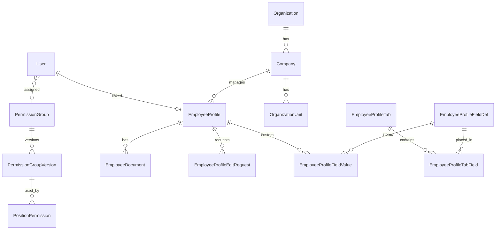
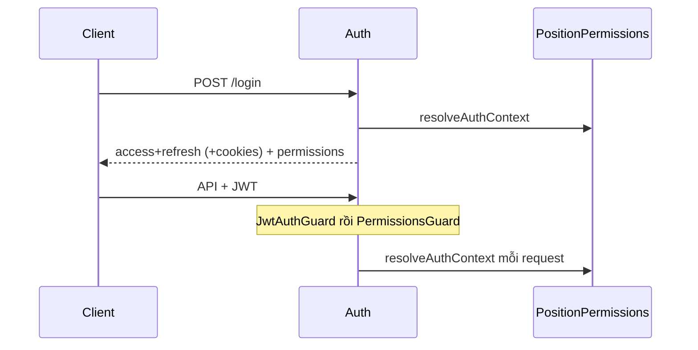

# Report phân tích chi tiết dự án ERP Hyperlabs

| Trường | Giá trị |
|--------|---------|
| Thời gian | 2026-07-22 19:47:24 (UTC+7) |
| Loại | Phân tích toàn repo (không sửa code ứng dụng) |
| Repo | `/Users/hyperlabs/Project/ERP/ERP` |
| Tên package root | `erp-hyperlabs` |
| Phạm vi | Monorepo apps + packages + prisma + deploy + CI + quy trình dev |

---

## 1. Yêu cầu

Phân tích chi tiết dự án và lưu toàn bộ thông tin phân tích vào file report trong `Documents/Reports`, đồng thời cập nhật chỉ mục `Report.md`.

---

## 2. Tóm tắt điều hành (Executive summary)

ERP Hyperlabs là **monorepo pnpm** (Node ≥ 22.12) cho hệ thống ERP nội bộ, tập trung giai đoạn hiện tại vào:

1. **Xác thực & phân quyền** — JWT cookie + Bearer; Super Admin bootstrap; quyền = Permission Group trên User ∪ Position Permission trên cây tổ chức.
2. **Tổ chức** — Organization → Company → OrganizationUnit (cây), gắn người đại diện / quản lý / thành viên + quyền theo vị trí.
3. **Nhân sự (HR)** — Hồ sơ nhân viên lifecycle, avatar, documents, family/education/work, form động (tabs/fields), import/export Excel async.
4. **Cá nhân (self-service)** — Xem/sửa hồ sơ liên kết, yêu cầu chỉnh sửa khi đã VERIFIED, quản lý tài khoản cá nhân.
5. **Thiết lập** — Tổ chức, nhóm quyền, catalog quyền, cấu hình tab/field hồ sơ.

**Stack chính:** NestJS 11 + Prisma 7 + PostgreSQL 18 + Redis/BullMQ + React 19 + Vite 8 + Ant Design 6.

**Kiến trúc runtime local:** API `:3001`, Web `:5173`, Worker (BullMQ), Postgres `:5432`, Redis `:6380` — khởi chạy bền bằng `pnpm dev:up` (nohup + PID `.local/dev/`).

---

## 3. Cấu trúc monorepo

```
ERP/
├── apps/
│   ├── api/          # @erp/api — NestJS HTTP API (producer BullMQ)
│   ├── web/          # @erp/web — React SPA (Vite)
│   └── worker/       # @erp/worker — BullMQ consumer (org-io + employee-io)
├── packages/
│   ├── shared/           # @erp/shared — types, permissions, enums, seed profile
│   ├── organization-io/  # @erp/organization-io — snapshot/diff/apply Excel|JSON
│   └── employee-io/      # @erp/employee-io — snapshot/diff/apply Excel + validate
├── prisma/               # schema.prisma + migrations (PostgreSQL)
├── scripts/              # dev-start/stop/status, deploy.sh
├── deploy/               # nginx.conf.example
├── Documents/Reports/    # báo cáo thay đổi & phân tích
├── .cursor/rules/        # luật Agent (quy trình + report)
├── docker-compose.yml    # postgres + redis only
├── ecosystem.config.cjs  # PM2: erp-api + erp-worker
└── .github/workflows/    # ci, test, deploy
```

**pnpm-workspace.yaml:** `apps/*`, `packages/*`.

**Đồ thị phụ thuộc (rút gọn):**

```
@erp/shared
    ↑
    ├── @erp/organization-io ──┐
    ├── @erp/employee-io ──────┤
    ├── @erp/api ──────────────┤→ Prisma / Redis enqueue
    ├── @erp/web               │
    └── @erp/worker ←──────────┘ consume queues, gọi *-io jobs
```

**Quy mô tham chiếu (thời điểm phân tích):** ~204 file `.ts`/`.tsx` trong apps+packages; `schema.prisma` ~545 dòng; 9 migration SQL.

---

## 4. Công nghệ & phiên bản

| Lớp | Công nghệ | Ghi chú |
|-----|-----------|---------|
| Runtime | Node ≥ 22.12 | engines root |
| Package manager | pnpm | lockfile `pnpm-lock.yaml` |
| API | NestJS ^11 | Config, JWT, Passport, Throttler |
| ORM | Prisma ^7 | `@prisma/adapter-pg` + `pg` Pool |
| DB | PostgreSQL 18 | docker-compose |
| Queue | BullMQ ^5 + ioredis ^5 | Redis 8, port host **6380** |
| Auth | JWT + bcrypt + cookie-parser + helmet | access/refresh, rotate refresh |
| Validation | class-validator / class-transformer | whitelist + forbidNonWhitelisted |
| Web | React ^19, Vite ^8, react-router ^7 | Ant Design ^6, axios |
| Shared libs | ExcelJS (IO packages) | |
| Test API | Jest 30 + Supertest | `*.e2e-spec.ts` |
| Test Web | Playwright ^1.61 | `apps/web/e2e` |
| Prod process | PM2 (API+Worker) + nginx (SPA) | |

---

## 5. Biến môi trường (từ `.env.example`)

| Nhóm | Biến chính |
|------|------------|
| DB | `DATABASE_URL` |
| Redis | `REDIS_HOST`, `REDIS_PORT` (6380), `REDIS_PASSWORD` |
| JWT | `JWT_SECRET`, `JWT_REFRESH_SECRET`, `JWT_ACCESS_EXPIRES_IN`, `JWT_REFRESH_EXPIRES_IN` |
| Cookie | `COOKIE_SECURE` |
| API | `API_PORT` (example 3000; local dev script dùng **3001**), `API_CORS_ORIGIN`, `UPLOAD_MAX_BYTES` |
| E2E | `TEST_ADMIN_EMAIL/PHONE/PASSWORD/FULL_NAME` |
| Web | `VITE_API_URL` (trống → Vite proxy `/api` → 3001) |

Infra Docker: user/db `erp`/`erp_db`, Redis password `erp_redis_secret`.

---

## 6. Runtime & vận hành local

### Scripts root

| Script | Lệnh | Mục đích |
|--------|------|----------|
| `dev:up` | `scripts/dev-start.sh` | nohup API/Web/Worker + PID `.local/dev/` |
| `dev:down` | `scripts/dev-stop.sh` | dừng theo PID / giải phóng cổng |
| `dev:status` | `scripts/dev-status.sh` | alive / listen / HTTP |
| `dev:api` / `dev:web` / `dev:worker` | filter pnpm | chạy foreground từng app |
| `build` / `test` | `pnpm -r` | build/test toàn workspace |
| `db:generate` / `db:migrate` / `db:push` | Prisma | |

### Cổng chuẩn local

| Dịch vụ | Cổng | Health |
|---------|------|--------|
| API | 3001 | `GET http://127.0.0.1:3001/api/health` |
| Web | 127.0.0.1:5173 | SPA |
| Postgres | 5432 | |
| Redis | 6380 | |

**Nguyên tắc:** ưu tiên `dev:up` để process **không bị kill** khi Agent Shell kết thúc; chỉ `dev:down` khi cần reset; không seed khi start.

### Production

- `scripts/deploy.sh`: env symlink → install → build packages → migrate → build apps → rsync web → PM2 reload.
- `ecosystem.config.cjs`: `erp-api`, `erp-worker`.
- `deploy/nginx.conf.example`: SPA `/var/www/erp`, proxy `/api/` → `127.0.0.1:3000`, `/uploads/` alias.

---

## 7. Database (Prisma)

### 7.1 Models theo domain

**Auth / Users**

- `User` — email/phone optional unique, `accountCode` (TK-xxxxx), `mustChangePassword`, `isActive`, `permissionGroupId`, `linkedEmployeeProfileId` (1-1 với hồ sơ).
- `RefreshToken` — hash SHA-256 của refresh JWT (`jti`).
- `Role` / `UserRole` / `RolePermission` — **legacy nội bộ**; runtime chỉ giữ `super_admin` (bootstrap), không expose CRUD Roles.
- `Permission` — catalog mã quyền.

**Permission Groups (lớp quyền nghiệp vụ)**

- `PermissionGroup` + `PermissionGroupPermission`
- `PermissionGroupVersion` + `PermissionGroupVersionPermission` — versioning khi gắn vị trí
- `PositionPermission` (`holderKind` + `holderId`) + `PositionPermissionParentScope`

**Organization**

- `Organization` → `Company` → `OrganizationUnit` (self-tree `parentUnitId`)
- Members: org rep / company members / unit manager & members; có thể `linkedProfileUserId → User`
- `Company` 1—* `EmployeeProfile` qua `managingCompanyId` (công ty chủ quản)

**Employee / HR**

- `EmployeeProfile` — identity, địa chỉ, Đảng/Đoàn, avatar, employmentStatus, lifecycle `status`, unique profileCode/phone…
- `EmployeeFamilyMember`, `EmployeeEducationHistory`, `EmployeeWorkHistory`
- `EmployeeDocument`
- `EmployeeProfileEditRequest` (PENDING / APPROVED / REJECTED / CANCELLED)

**Profile UI động**

- `EmployeeProfileTab` ↔ `EmployeeProfileFieldDef` qua `EmployeeProfileTabField`
- `EmployeeProfileFieldValue` (JSON) khi field không có `storageKey` (custom)
- `storageKey` map cột built-in trên `EmployeeProfile`
- Migration trung gian `employee_profile_field_settings` đã được thay bởi tabs/fields

### 7.2 Enums quan trọng

| Enum | Giá trị chính |
|------|----------------|
| `EntityStatus` | ACTIVE, INACTIVE |
| `PositionHolderKind` | ORGANIZATION_REP, COMPANY_REP, UNIT_MANAGER, UNIT_MEMBER |
| `EmployeeGender` | MALE, FEMALE, OTHER |
| `EmployeeProfileStatus` | INCOMPLETE, PENDING_REVIEW, NEEDS_ADJUSTMENT, VERIFIED, LOCKED |
| `EmployeeEmploymentStatus` | APPRENTICE, INTERN, PROBATION, OFFICIAL, RESIGNED, OTHER |
| `EmployeeProfileFieldDataType` | TEXT, TEXTAREA, NUMBER, DATE, PHONE, EMAIL, SELECT, MULTISELECT, BOOLEAN, SECTION |
| `EmployeeProfileEditRequestStatus` | PENDING, APPROVED, REJECTED, CANCELLED |

### 7.3 Migrations (thứ tự thời gian)

1. `20260721100000_init`
2. `20260721161500_employee_avatar`
3. `20260721164500_employee_profile_lifecycle`
4. `20260721232000_employee_profile_edit_requests`
5. `20260722001000_employee_documents`
6. `20260722023000_user_permission_group`
7. `20260722030000_employee_managing_company`
8. `20260722090000_employee_profile_field_settings`
9. `20260722100000_employee_profile_tabs_fields`

**Xu hướng:** lifecycle hồ sơ + self-service edit request + documents/avatar → User gắn PermissionGroup → managing company → form hồ sơ configurable (tabs/fields).

### 7.4 ER rút gọn



---

## 8. Package `@erp/shared`

Barrel duy nhất `packages/shared/src/index.ts`.

**Nội dung chính:**

- Enums domain HR/org/permission/profile field
- `Permissions` object (mã `setup:*`, `user:*`, `hr:employee:*`, `permission_group:*`, `organization:*`, `company:*`, `org_unit:*`) + `ALL_PERMISSIONS`
- Helpers: `hasPermission`, `hasAnyPermission`, `orgScopeKey`, `hasOrgScopeAccess`
- JWT types: `JwtPayload`, `AuthTokens`
- Account code: `ACCOUNT_CODE_PREFIX` (`TK-`), `formatAccountCode` / `parseAccountCodeSequence`
- Org tree types: `OrgTreeNode`, `OrgMember`, `OrgScopeNode`, `PositionPermissionSummary`
- Seed form: `DEFAULT_PROFILE_TABS`, `DEFAULT_PROFILE_FIELDS`, `BUILTIN_PROFILE_STORAGE_KEYS`
- Lifecycle transitions: `HR_EMPLOYEE_STATUS_TRANSITIONS`, `getAllowedEmployeeStatusTransitions`
- Catalogs: `ETHNICITIES`, labels employment / field data type
- `SystemRole.SUPER_ADMIN` — role nội bộ duy nhất, không CRUD

---

## 9. API (`apps/api`) — NestJS 11

### 9.1 Bootstrap (`main.ts`)

- Global prefix: `api`
- Helmet (CSP tắt, CORP cross-origin), cookie-parser
- ValidationPipe: whitelist + forbidNonWhitelisted + transform
- Static `/uploads/*` (avatar/documents) ngoài prefix `/api`
- CORS credentials theo `API_CORS_ORIGIN`
- Throttler global ~120 req/60s; auth endpoints throttle riêng

### 9.2 Modules trong `AppModule`

`Config`, `Throttler`, `Prisma` (global), `Auth`, `Users`, `Permissions`, `Health`, `Queue`, `Organization`, `PermissionGroups`, `Employees`, `Personal`.

**Đã xóa:** `apps/api/src/roles/` (API `/roles` 404).

### 9.3 Endpoints theo domain (prefix `/api`)

#### Health
- `GET /health` — public

#### Auth `/auth`
| Method | Path | Ghi chú |
|--------|------|---------|
| POST | `/bootstrap` | Super Admin lần đầu (DB trống), throttle chặt |
| POST | `/login` | email / phone / accountCode |
| POST | `/refresh` | body hoặc cookie |
| POST | `/logout` | revoke + clear cookies |
| GET | `/me` | user + permissions + orgScopes |
| POST | `/change-password` | lần đầu có thể không cần MK cũ |

Cookies: `erp_access` (path `/`), `erp_refresh` (path `/api/auth`), httpOnly, sameSite=lax.

#### Users `/users`
CRUD tài khoản; tạo bằng `employeeProfileId` + `permissionGroupId` (không còn `roleIds`).

#### Permissions `/permissions`
Catalog quyền (group theo module).

#### Permission groups `/permission-groups`
CRUD nhóm; xem version permissions / accounts gắn version.

#### Organization `/organization`
Org info, tree (+ filter orgScopes), companies/units CRUD+reorder, positionPermission trên holder, IO export/diff/apply + job poll/download.

#### Employees `/employees`
CRUD + soft/hard delete, check-or-create, complete, status transitions, avatar/documents, family/education/work (+ reorder), edit-requests approve/reject, IO export/diff/apply.

#### Employee profile settings `/employee-profile-settings`
- `GET /` — JWT only (layout cho form động)
- CRUD tabs/fields, attach/detach/reorder — `setup:manage`
- Legacy bulk PUT visible/required

#### Personal `/personal`
Chỉ JWT, **không** PermissionsGuard: account, profile, complete, avatar/docs, edit requests, family/education/work.  
Quy tắc: VERIFIED → cần edit request; INCOMPLETE / NEEDS_ADJUSTMENT → sửa trực tiếp.

### 9.4 Auth & permission model



**Resolve quyền:**

1. Super Admin (`Role.code = super_admin`) → `ALL_PERMISSIONS`, `orgScopes = []`
2. User thường → quyền từ `User.permissionGroup` ∪ PositionPermission theo vị trí org tree (ORGANIZATION_REP / COMPANY_REP / UNIT_MANAGER / UNIT_MEMBER) + tính orgScopes từ `includeSelf` + parentScopes

**Guards:**

- `JwtAuthGuard` — cookie hoặc Bearer; nếu `mustChangePassword` mà route không `@AllowPasswordChangeRequired` → 403
- `PermissionsGuard` — `@RequirePermissions` cần **ít nhất một** quyền

**Sync khởi động (`PermissionsSyncService`):** upsert catalog; xóa permission deprecate (ROLE_*); đảm bảo `super_admin` + ALL; **xóa mọi Role khác**.

### 9.5 Queue (API = producer)

`QueueService` → Redis:

| Queue | Jobs |
|-------|------|
| `erp-organization-io` | export, diff, apply |
| `erp-employee-io` | export (± template), diff, apply |

Flow: upload → `tmp/organization-io` hoặc `tmp/employee-io` → enqueue → poll job → download. Employee jobs gắn `requestedByUserId` (owner-only).

### 9.6 E2E API (`apps/api/test/`)

| File | Cover |
|------|-------|
| `health.e2e-spec.ts` | health |
| `auth.e2e-spec.ts` | login/me/refresh/logout |
| `permissions.e2e-spec.ts` | catalog; users không roleIds; `/roles` gỡ |
| `permission-groups.e2e-spec.ts` | CRUD groups; Super Admin bảo vệ; positionPermission |
| `organization.e2e-spec.ts` | org tree/companies/units |
| `organization-io.e2e-spec.ts` | Excel/JSON IO qua BullMQ |
| `employees.e2e-spec.ts` | hồ sơ đầy đủ lifecycle/docs/avatar |
| `employee-io.e2e-spec.ts` | export/diff/apply |
| `employee-profile-settings.e2e-spec.ts` | tabs/fields + customValues |
| `account-employee-flow.e2e-spec.ts` | account từ profile, mustChangePassword |
| `personal.e2e-spec.ts` | self-service + edit request |
| `test-utils.ts` / `test-admin-env.ts` | helpers |

---

## 10. Worker (`apps/worker`)

Process độc lập: Redis + Prisma, **không HTTP**.

- Consume `erp-organization-io` → `runOrganization*` từ `@erp/organization-io`
- Consume `erp-employee-io` → `runEmployee*` từ `@erp/employee-io`
- Storage tạm dưới `tmp/*-io`; employee-io có cleanup TTL ~24h

---

## 11. Packages IO

### 11.1 `@erp/organization-io`

| Module | Chức năng |
|--------|-----------|
| snapshot | `loadOrganizationSnapshot(prisma)` |
| excel | read/write workbook (Organization, Members, Companies, Units…) |
| json | serialize/parse + detect format |
| diff | new / changed / unchanged / missing_in_file |
| apply | `applyOrganizationSelections` theo selectionKey |
| jobs | orchestration export/diff/apply + restore |

Định dạng: **Excel | JSON**.

### 11.2 `@erp/employee-io`

| Module | Chức năng |
|--------|-----------|
| snapshot | load employees + family/education/work |
| excel | workbook + **template** rỗng; sheets HuongDan, Employees, … |
| validate | normalize + validate (ngày/SĐT/CCCD; status import giới hạn) |
| diff | có `selectable` — MISSING_IN_FILE **không** apply |
| apply | apply selections |
| jobs | export / template / diff / apply + cleanup |

Định dạng: **chỉ Excel**.

---

## 12. Web (`apps/web`) — React 19 + Ant Design 6

### 12.1 Vite

- Port 5173; proxy `/api` và `/uploads` → `http://localhost:3001`
- Alias `@erp/shared` → `packages/shared/src/index.ts`

### 12.2 Routes (`App.tsx`)

**Public:** `/login`, `/change-password`

**Protected (MainLayout):**

| Path | Trang |
|------|-------|
| `/` | Dashboard |
| `/personal/profile`, `/edit`, `/personal/account` | Cá nhân |
| `/hr/accounts`, `/hr/accounts/:id` | Tài khoản |
| `/hr/employees`, `/new`, `/:id`, `/:id/edit` | Hồ sơ HR |
| `/setup/organization` | Tổ chức |
| `/setup/hr/profile-fields` | Cấu hình tab/field |
| `/setup/permission-groups` | Nhóm quyền |
| `/setup/permissions` | Catalog quyền |

**Redirect legacy:** `setup/roles` → permission-groups; `setup/accounts|users` → hr/accounts.

`ProtectedRoute`: loading → login nếu chưa auth → `/change-password` nếu `mustChangePassword`.

### 12.3 Menu (`MainLayout`) — theo quyền

- Luôn: Tổng quan, Hồ sơ cá nhân, Tài khoản cá nhân
- HR employees: `HR_EMPLOYEE_VIEW` / `HR_VIEW`
- HR accounts: `USER_VIEW`
- Organization: `ORGANIZATION_VIEW`
- Profile fields: `SETUP_VIEW` / `SETUP_MANAGE`
- Permission groups: `PERMISSION_GROUP_VIEW`
- Permissions: `PERMISSION_VIEW`

### 12.4 AuthContext

- `GET /auth/me` khi mount
- Access token **in-memory** (không localStorage); axios `withCredentials`
- Interceptor 401 → refresh cookie → retry; fail → `/login`
- `hasPermission`: `isSystemAdmin` hoặc includes permission

### 12.5 Domain UI nổi bật

| Domain | File chính | Ghi chú |
|--------|------------|---------|
| Employees | `EmployeesPage`, `EmployeeFormPage`, `EmployeeDetailPage`, create dialog, avatar, documents, IO | Form lớn + guided panel |
| Dynamic fields | `DynamicProfileFields`, `DynamicProfileDetailTabs`, `useEmployeeProfileFieldSettings` | Layout từ API |
| Accounts | `AccountsPage`, `AccountDetailPage` | permissionGroupId |
| Organization | `OrganizationPage` (~1650 dòng) | tree + positionPermission + IO |
| Permission groups | `PermissionGroupsPage` | CRUD + versions |
| Profile settings | `EmployeeProfileFieldSettingsPage` | tabs + field library |
| Personal | `PersonalAccountPage` + reuse EmployeeDetail/Form | dual-mode theo pathname |

### 12.6 Patterns quan trọng

1. **Dynamic profile:** `storageKey` → cột built-in; không có → `customValues[code]`; SECTION → family/education/work riêng.
2. **IO async:** export/diff/apply → poll job → download hoặc Modal chọn rows → apply → reload.
3. **Dual-mode HR/Personal:** cùng component, khác endpoint & rule edit.
4. **Lifecycle:** INCOMPLETE → PENDING_REVIEW → VERIFIED / NEEDS_ADJUSTMENT / LOCKED; personal VERIFIED cần edit request.

### 12.7 E2E Playwright

| Spec | Nội dung |
|------|----------|
| `login.spec.ts` | login email/mã TK/SĐT |
| `accounts.spec.ts` | accounts + redirects + nhóm quyền |
| `employees.spec.ts` | tạo draft, form, công ty chủ quản |
| `organization.spec.ts` | cây org, IO, leaf employees |
| `personal.spec.ts` | menu cá nhân, edit request khi VERIFIED |
| `profile-fields.spec.ts` | setup tabs/fields |

*(Đã xóa `roles.spec.ts`.)*

---

## 13. CI/CD (GitHub Actions)

| Workflow | Trigger | Việc làm |
|----------|---------|----------|
| `ci.yml` | PR → main; push nhánh ≠ main | gọi `test.yml` |
| `test.yml` | `workflow_call` | Postgres 18 + Redis 8 → install → prisma generate → build packages → migrate → API Jest e2e → Playwright → upload artifact |
| `deploy.yml` | push `main` | chạy test → self-hosted → `scripts/deploy.sh` |

---

## 14. Phân quyền — bản đồ khái niệm

```
                    ┌─────────────────────┐
                    │   Super Admin       │
                    │ ALL_PERMISSIONS     │
                    └──────────┬──────────┘
                               │ bypass
                               ▼
┌──────────────────────────────────────────────────────────┐
│ Effective permissions của User thường                    │
│  (1) PermissionGroup gắn User                            │
│  ∪ (2) PositionPermission theo vị trí trên org tree      │
│      (có thể dùng PermissionGroupVersion cắt quyền)      │
│  + orgScopes để filter cây tổ chức                       │
└──────────────────────────────────────────────────────────┘
```

**Thay đổi kiến trúc gần đây:** Roles CRUD nghiệp vụ → **Permission Groups**; Role schema chỉ còn bootstrap `super_admin`.

---

## 15. Luồng nghiệp vụ then chốt

### 15.1 Onboarding hồ sơ → tài khoản

1. HR tạo hồ sơ (draft / check-or-create theo SĐT)
2. Điền form động (tabs/fields) + family/education/work + documents/avatar
3. Complete / chuyển status lifecycle
4. Tạo User từ hồ sơ + gán PermissionGroup → `mustChangePassword`
5. User login → đổi MK → dùng Personal / các module theo quyền

### 15.2 Self-service khi đã VERIFIED

1. Personal mở hồ sơ → tạo edit request
2. HR review approve/reject
3. (Theo rule API) chỉnh sửa sau khi được duyệt / trạng thái cho phép

### 15.3 Import/Export

1. UI gọi export hoặc upload file → API enqueue
2. Worker chạy package `*-io`
3. UI poll job → download hoặc chọn diff → apply
4. Employee import: không xóa bản ghi “missing in file”

---

## 16. Điểm mạnh / rủi ro / nợ kỹ thuật (quan sát)

### Điểm mạnh

- Tách rõ API / Web / Worker / packages IO thuần
- Phân quyền hai lớp (account group + org position) phù hợp ERP
- Form hồ sơ configurable giảm hardcode FE
- E2E API + Playwright phủ các domain chính
- Dev runtime bền (`dev:up`) tách khỏi Agent Shell
- Quy trình Agent + Report đã chuẩn hóa trong `.cursor/rules`

### Rủi ro / lưu ý

- File UI lớn (`OrganizationPage`, `EmployeeFormPage`) — khó maintain nếu tiếp tục phình
- Schema còn bảng Role legacy — cần kỷ luật sync để không “hồi sinh” role nghiệp vụ
- Port API lệch giữa `.env.example` (3000) và local script (3001) / nginx example (3000) — dễ nhầm khi deploy/dev
- Job IO phụ thuộc Redis; mất Redis → import/export fail
- Status `dev:status` có thể báo `alive=no` nếu PID cha nohup/pnpm chết trong khi process con vẫn listen — cần hiểu PID file theo dõi process gốc

### Nợ / hướng mở rộng tiềm năng (không phải yêu cầu hiện tại)

- Module ERP khác ngoài HR/Org (kế toán, kho…) chưa thấy trong codebase hiện tại
- JSON IO mới có cho organization, chưa cho employee
- Một số trang setup/HR rất dài — có thể tách hooks/components

---

## 17. Sơ đồ kiến trúc tổng thể

```mermaid
flowchart TB
  subgraph Client
    Web[React SPA :5173]
  end

  subgraph Apps
    API[NestJS API :3001]
    Worker[BullMQ Worker]
  end

  subgraph Data
    PG[(PostgreSQL :5432)]
    Redis[(Redis :6380)]
    Uploads[/uploads/]
  end

  subgraph Packages
    Shared[@erp/shared]
    OrgIO[@erp/organization-io]
    EmpIO[@erp/employee-io]
  end

  Web -->|/api cookie JWT| API
  Web -->|/uploads| Uploads
  API --> PG
  API -->|enqueue| Redis
  Worker --> Redis
  Worker --> PG
  Worker --> OrgIO
  Worker --> EmpIO
  API --> Shared
  Web --> Shared
  API --> OrgIO
  API --> EmpIO
```

---

## 18. Việc đã thực hiện (cho report này)

1. Quét cấu trúc monorepo, `package.json`, workspace, docker, env example.
2. Phân tích sâu `apps/api` (modules, auth, endpoints, queue, e2e).
3. Phân tích sâu `apps/web` (routes, auth, domains, patterns, Playwright) và `prisma` (models, enums, migrations).
4. Phân tích `packages/*`, `apps/worker`, deploy, scripts, CI.
5. Tổng hợp toàn bộ vào file report này.
6. Cập nhật chỉ mục `Documents/Reports/Report.md`.

---

## 19. Kết quả

- **Thành công:** Có tài liệu phân tích toàn diện repo ERP Hyperlabs tại file này, đủ làm baseline kiến trúc / onboarding / tham chiếu khi thay đổi sau.
- **Không sửa** code ứng dụng (API/Web/Worker/packages/prisma schema).
- **Follow-up gợi ý (tùy chọn):** tách report theo domain thành nhiều file; vẽ sơ đồ sequence cho edit-request; đồng bộ tài liệu port API 3000 vs 3001 trong env examples.

---

*Hết báo cáo phân tích.*
